# 停车场微信小程序(文末获取方式☟)
> 
#### 介绍
停车场微信小程序(Java_SSM_微信小程序)
有BUG可留言加微

#### 软件架构
Java + SSM + 微信小程序 + Mybatis + Mysql

#### 项目功能说明

> + 系统分为管理员、车位商家、车主三个角色
> + 登录注册
> + 管理员管理、车位商家管理、车主角色管理
> + 停车场信息管理
> + 预约停车管理
> + 取消预约管理
> + 进场停车管理
> + 离场收费管理
> + 留言板管理
> + 系统管理：通知公告、轮播图管理

### 部分功能演示
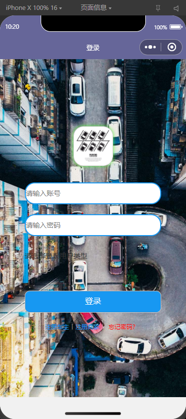
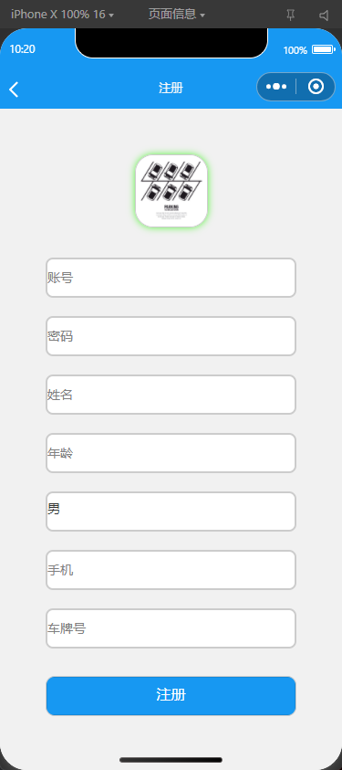
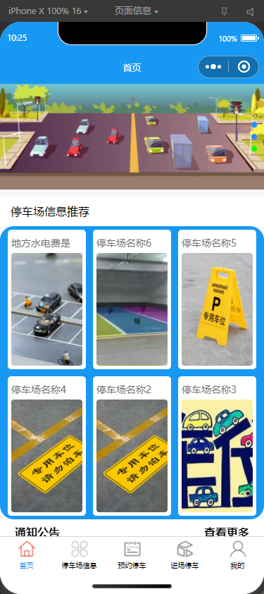
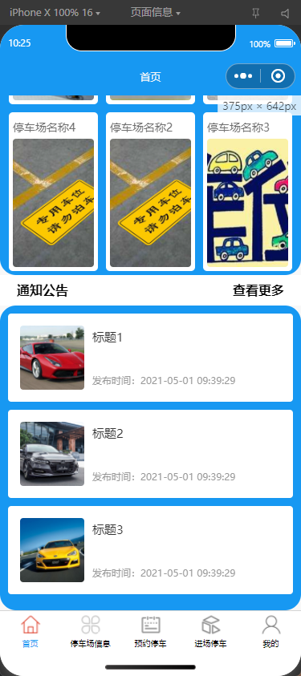
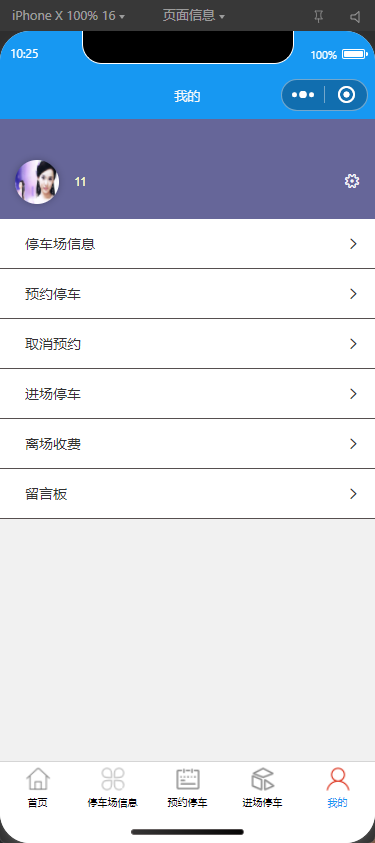

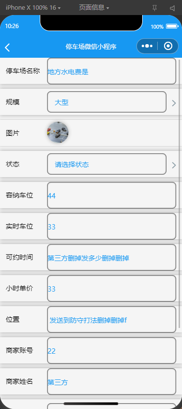
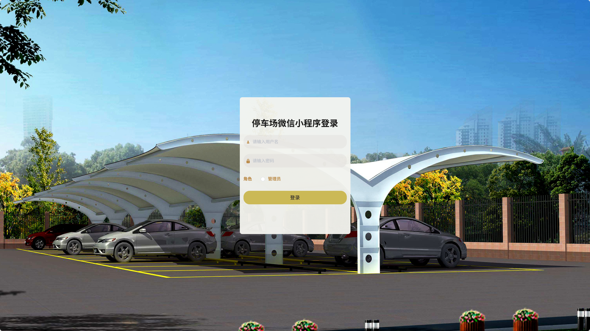
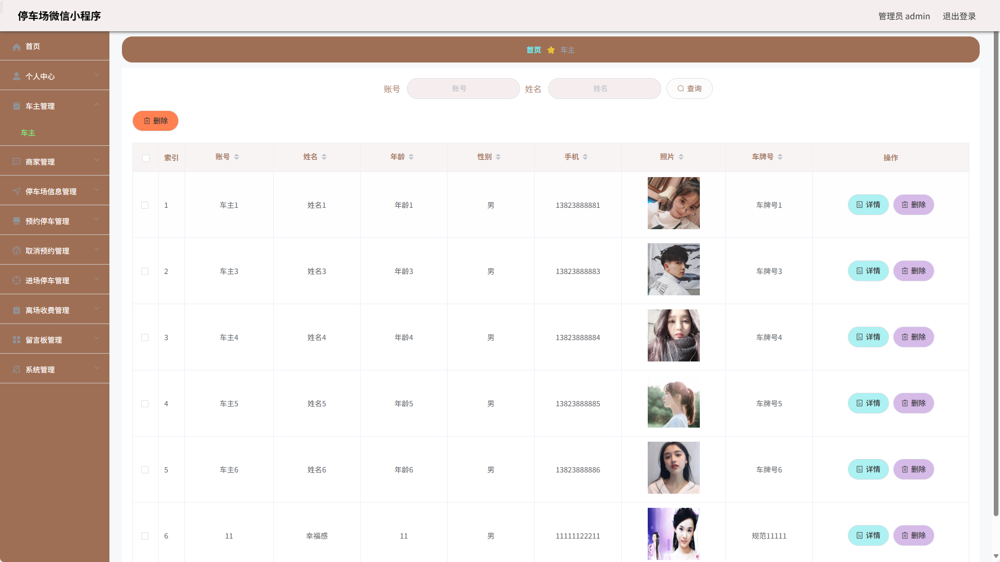

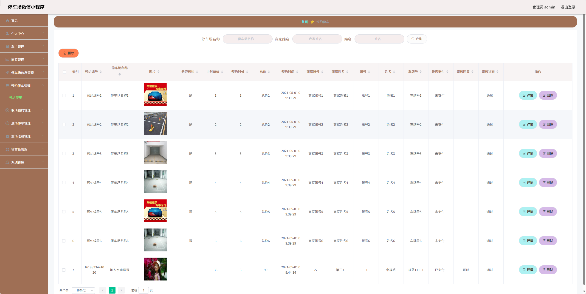
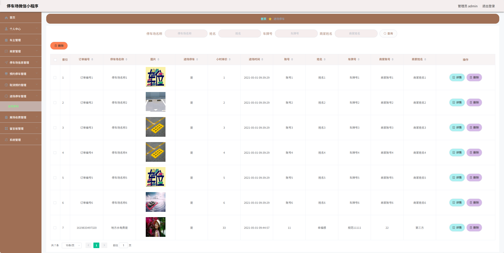
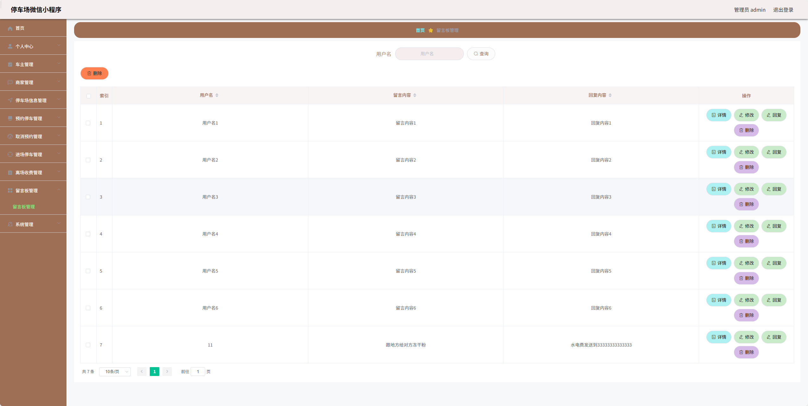
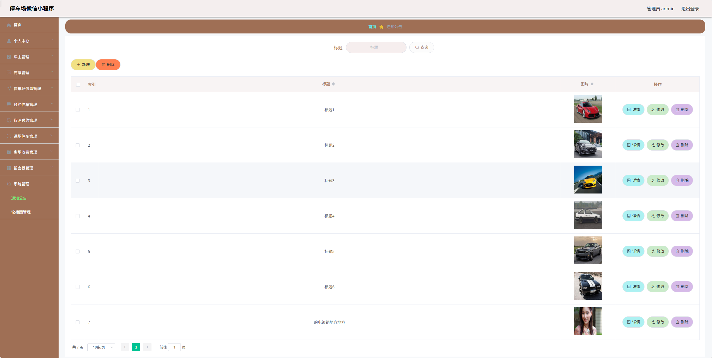

### 环境需求(可免费提供)
- idea/eclipse、jdk-1.8、maven-3.8.6、mysql、node.js等

## 有项目修改、安装调试需求 请联系以下

## 获取资源扫☝☝☝

